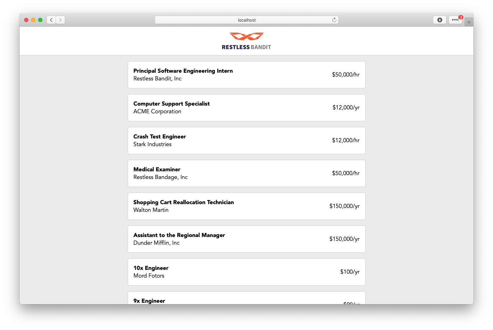
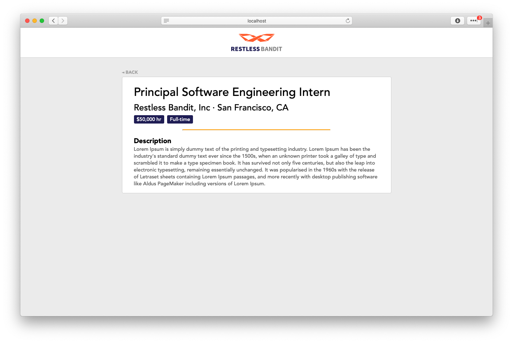

# Restless Bandit's Fullstack Challenge

Welcome! This exercise is designed to let you show us how you work on a full-stack feature, in a way that's fairly representative of how you'd work as part of our team.

It should take you somewhere between 1 and 3 hours to implement.

## The Scenario

Our users want the ability to see all of our open jobs, both as a scannable list, as well as a detailed card.

We have a working design and some basic app infrastructure.

**Your task is to:**

- **Define a schema to represent the data involved, and add test data based on that schema**
- **Define SQL queries to pull the data into the UI**
- **Build the rest of the UI based on the mockup**

## Designs





**What we're looking for:**

- Accurate translation of the design and attention to UI/UX details
- Readable and properly linted code
- Clear communication and documentation
- Adherence to conventions (SQL, JS, React, UX ...) when appropriate

**Extra (optional) features:**

- Basic pagination
- Sorting/filtering/searching
- Mobile gestures/inputs
- Do something else cool/creative - it can be anything you like!

Feel free to add any libraries you would find useful (just be sure to `npm install --save` them).

## Setup

### Tooling

You'll need to have a few things installed beforehand:

- [Node]()
- [npm]()
- [Docker]()
- [Docker Compose]()
- [prettier]()
- [eslint]()

We expect that you have a favorite DB client, but in case you don't, here are our recommendations:

- [TablePlus](https://www.tableplus.io/download) (has a free version)
- [DBeaver](https://dbeaver.io/) (totally free)
- [DataGrip](https://www.jetbrains.com/datagrip/) (30-day trial)
- [psql](https://www.postgresql.org/docs/9.2/app-psql.html) (totally free)

We also recommend having a gif recording tool (e.g. [Gifox](https://gifox.io/), [droptogif](https://github.com/mortenjust/droptogif)).

## Running the app

The app is made up of two parts:

- A Postgres database, running at http://localhost:7081/
- A Node server, serving a React app at http://localhost:7080/

You can build and run both by doing:

```sh
sh start.sh
```

### Development

To make database changes:

1. Update the file `db/init.sql`.
2. Rebuild the database with `sh start.sh`
3. Using your DB client, connect to the database, which should be available at:

   ```
   Host: 127.0.0.1
   Port: 7081
   User: postgres
   (No password)
   Database: jobapp
   ```

To make UI changes:

1. Within the `ui/` directory, run `npm install`.
2. Make sure you have Postgres running in the background (see above).
3. Run `npm start` to start the UI in development mode.
4. As you make edits to ui/src, a hot-reloading React app will be served at http://localhost:3000/.
5. To view the changes in "production", rebuild `start.sh`, and the app should be updated at `http://localhost:7080`.

Some notes about the UI:

- The scaffolding in this project uses `styled-components` for styling through the `css` prop. You're welcome to use this paradigm or any other CSS framework you're comfortable with. (If you choose to use another framework, you may want to the existing styling code.)
  - We do recommend using a framework that has an API explicitly involving CSS. While libraries like Bootstrap and Material UI have their use cases, we want you to showcase your own CSS knowledge.
- Also feel free to add any additional libraries or plugins. The Babel configuration can be configured at `ui/.babelrc`, and the Webpack configuration can be configured by adding a [`ui/razzle.config.js` file](https://github.com/jaredpalmer/razzle/tree/master/examples/with-custom-webpack-config).

**Linting:**

To maintain quality and readability of our code without spending time on minutiae, we use linting tools like Eslint and Prettier. With both installed, you can lint your code with `npm run lint`.

Even better, editors like VSCode have [features](https://code.visualstudio.com/updates/v1_6#_format-on-save) that automatically format your code whenever you save.

## Submitting

In this exercise, we want to simulate how we'd work with you on our team. With that in mind, we'd like you to do the following in your development workflow:

1. Clone this repo to your Github account
2. Branch off from `master` into a new branch (you can name this branch as you see fit).
3. Implement the new features!
4. When you're ready to submit, open a pull request from your working branch to your repo's `master` branch.
5. Format and write out the opening comment as if another engineer would jump in to do a code review -- provide context, changes made, screenshots/gifs, etc.
6. Let us know when your code is ready to review -- we'll be looking at this PR, as well as QA on your production app at `http://localhost:7080`.
